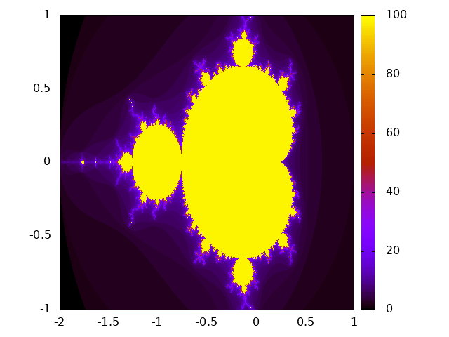
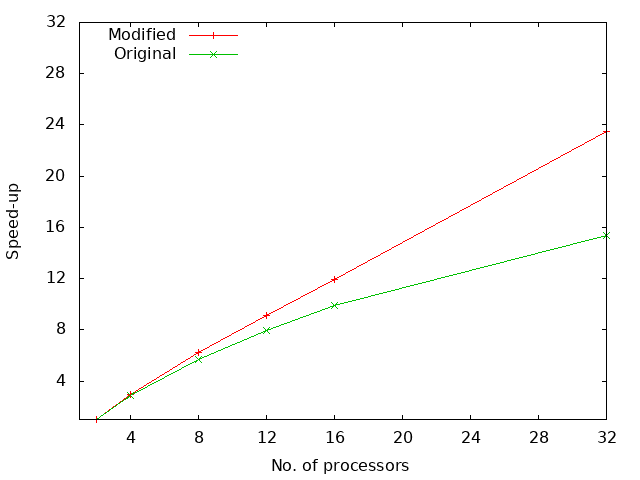

# Mandelbrot MPI manager-workers modified

[Visit Github README.md link for better visual !!!](https://github.com/dathd6/Mandelbrot-MPI/blob/main/README.md)

### Files structure

- [mandelbrot_mpi_mw.c](./mandelbrot_mpi_mw.c): Modified version of the program
- [mandelbrot_mpi_mw_origin.c](./mandelbrot_mpi_mw_origin.c): Original program
- [run_mandelbrot_mw.sh](./run_mandelbrot_mw.sh): Bash script to run the program (named `mandelbrot_mpi_mw`) using 2, 4, 8, 12 and 16 MPI process on one node
- [run_mandelbrot_mw_2nodes.sh](./run_mandelbrot_mw_2nodes.sh): Bash script to run the program (named `mandelbrot_mpi_mw`) using 32 MPI process on two nodes
- [plot_mandelbrot](./plot_mandelbrot): Gnuplot script to generate mandelbrot set from `mandelbrot_mpi_mw.dat`
    - 
- [plot_scaling](./plot_scaling): Gnuplot script to generate plot for scaling test to compare scaling speed of modified program and original program
    - 

### Execution

Dependencies: `mpicc`, `mpirun`, `sbatch` and `module` commands are required
Note: These commands are executed on Isca

Load module

```bash
$ module loads intel/2017b
```

#### Task 1

Note: Set `doIO` and `verbose` to true for both [mandelbrot_mpi_mw.c](./mandelbrot_mpi_mw.c) and [mandelbrot_mpi_mw_origin.c](./mandelbrot_mpi_mw_origin.c)

Compile the original C program and run parallel the program using `mpirun`
P/s: You may want to change the name of the `mandelbrot.dat` file to `mandelbrot_original.dat` for later comparison

```bash
$ mpicc -o mandelbrot_mpi_mw mandelbrot_mpi_mw_origin.c -lm
$ mpirun ./mandelbrot_mpi_mw
$ mv mandelbrot.dat mandelbrot_original.dat
```

Do the same with the modified program
P/s: You may want to change the name of the `mandelbrot.dat` file for 

```bash
$ mpicc -o mandelbrot_mpi_mw mandelbrot_mpi_mw.c -lm
$ mpirun ./mandelbrot_mpi_mw
```

Compare to generated data, If there are no error message --> two files are the same --> Right implementation of the modified program

```bash
$ diff --brief mandelbrot.dat mandelbrot_original.dat
```

Plot the Mandelbrot set

```bash
gnuplot ./plot_mandelbrot
```

#### Task 2

Run the program using 2, 4, 8, 12, and 16 MPI processes

```bash
$ sbatch ./run_mandelbrot_mw.sh
```

Wait till it is finished ...
Check by tail the files

```bash
$ tail -f slurm-ID.out
```

Run the program using 32 MPI processes and 2 nodes

```bash
$ sbatch ./run_mandelbrot_mw_2nodes.sh
```

For each run of the script, it will generate a slurm-ID.out file. We have to run the original program with the same above step.
Eventually, we want to have 4 slurm-ID.out files.

Get data parallel-speed up and number of MPI processes from slurm-ID.out file and add to .dat files (modified and origin separately)

```bash
$ awk '/STATS/ {print $6, $7, 90.985/$7}' < slurm-modifiedID1.out >> scaling_speed.dat
$ awk '/STATS/ {print $6, $7, 90.985/$7}' < slurm-modifiedID2.out >> scaling_speed.dat
$ awk '/STATS/ {print $6, $7, 90.985/$7}' < slurm-originID1.out >> scaling_speed_origin.dat
$ awk '/STATS/ {print $6, $7, 90.985/$7}' < slurm-originID2.out >> scaling_speed_origin.dat
```

Generate plot showing the results from your scaling test. The plot should show parallel-speed up against number of MPI processes for both the original program and your modified version. This will generate [scaling.png](./scaling.png)

```bash
$ gnuplot plot_scaling
```


